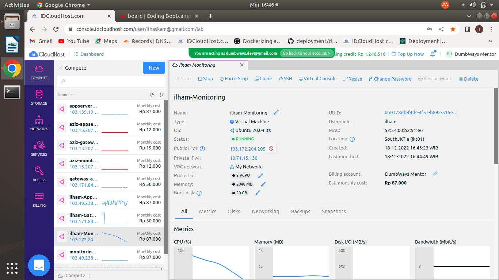

# Cloud Computing

## Before you start the task, please read this:
### - Please screenshot the command step-by-step
### - Describe the process in your final task repository

## Requirements
### - Setup 3 VMs with the following specs
   #### - Appserver - 2 vCPU, 2GB RAM - 20GB Storage
   

   #### - Gateway - 1 vCPU, 1GB RAM - 20GB Storage
   

   #### - Monitoring - 2 vCPU, 2GB RAM - 20GB Storage
   


## Instructions
### - User login without password authentication

* #### - Untuk step ini saya jabarkan di dalam tugas ssh.

### - Remove password login method

* #### - Masuk ke dalam file /etc/ssh/sshd_config. Ubah PasswordAuthentication yang semula yes menjadi no. Ini akan membuat server kita saat diremote tidak perlu memasukkan password. Catatan : perlu diingat sebelum menjalankan step ini pastikan sudah menambahkan public key ke dalam file authorized_keys di dalam server yang ingin kita remote, jika belum menambahkan public key, maka kita tidak bisa masuk ke dalam server.
   ```
   sudo nano /etc/ssh/sshd_config
   ```
   

   

   

   

* #### - Jangan lupa untuk me-restart ssh.
   ```
   sudo systemctl restart ssh
   ```
   

### - All servers are **not allowed** to use *Public IP* (except Gateway)