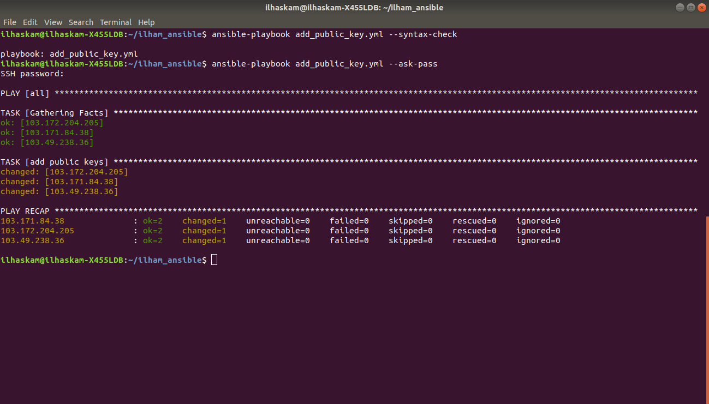
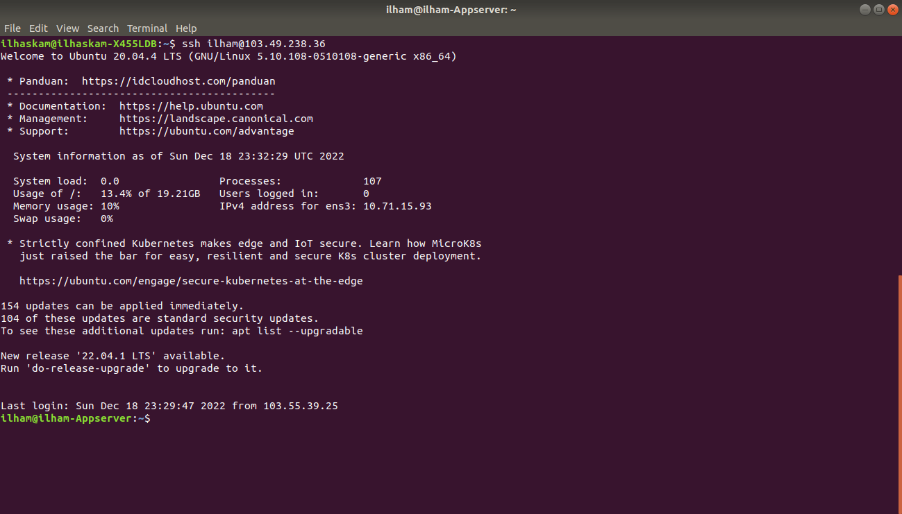

# SSH

## Before you start the task, please read this:

### - Please screenshot the command step-by-step
### - Describe the process in your final task repository

## Requirements

### - Create a pair of SSH key

* #### - Buat private key dan public key.
   ```
   ssh-keygen
   ```
   

* #### - Saya menggunakan ansible untuk mengirim public key ke dalam server appserver, gateway, dan monitoring.
   

   

   

   

* #### - Lalu cek di dalam ketiga server tadi apakah sudah ada public key di dalam file authorized_keys.
   

   

   

   


## Instructions

### - Only use 1 key for all features
### - Configure your SSH in 1 configuration file

* #### - Buat file config di dalam direktory .ssh
   

   

* #### - Dengan membuat file configurasi di dalam direktory .ssh, kita bisa me-remote server tanpa menggunakan ip dari server yang dituju, dikarenakan di dalam file config kita sudah membuat konfigurasi bahwa saat "ssh appserver", berarti kita ssh ke user bernama ilham dengan ip yang ada di dalam file config dengan Hostname appserver.
   

   

   

   

   

### - For CI/CD, **use the only 1 same key**