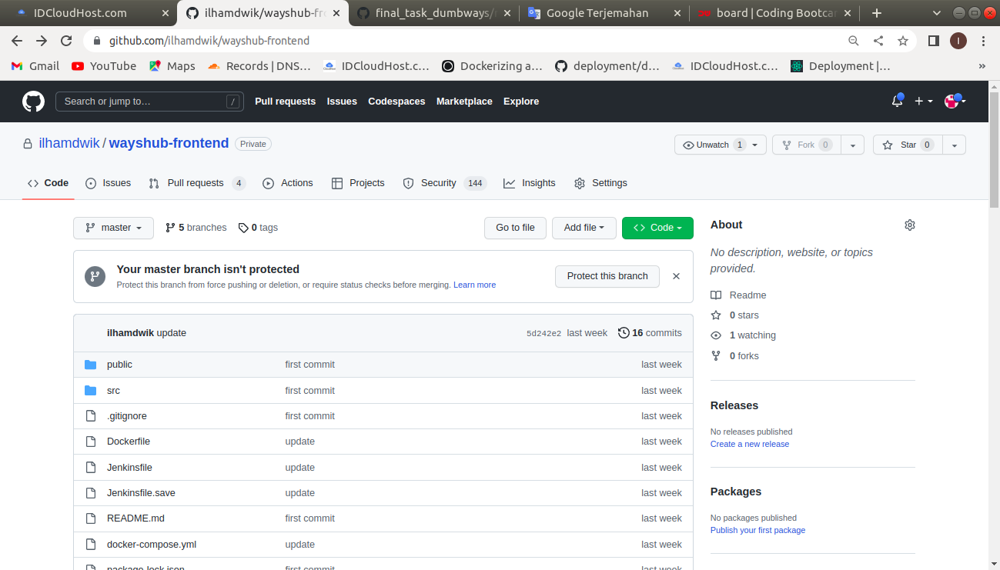
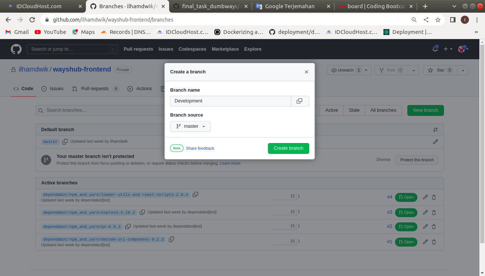
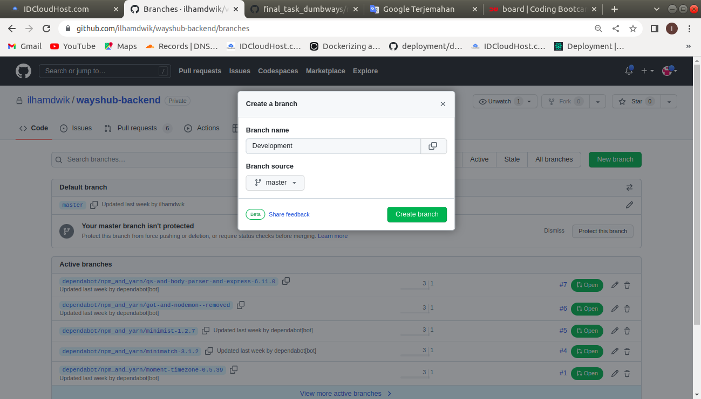
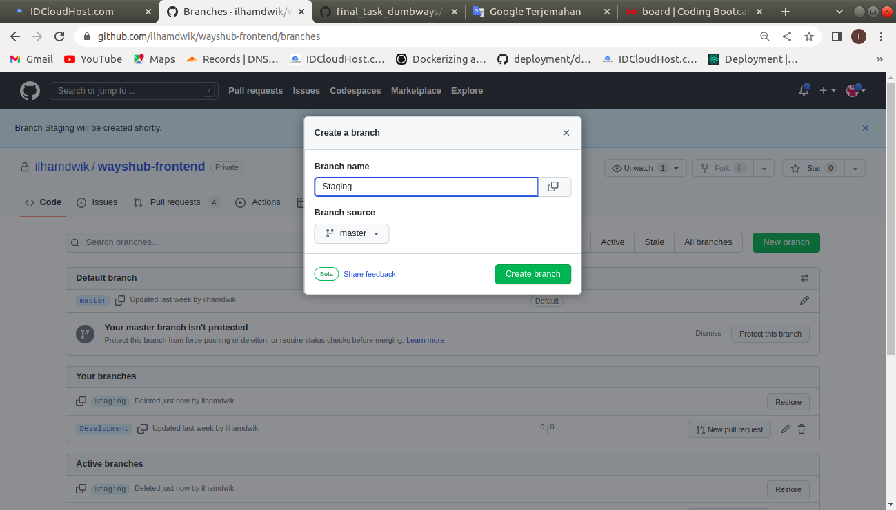
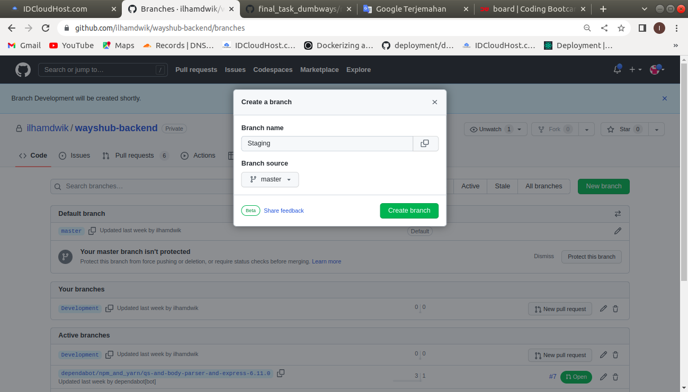
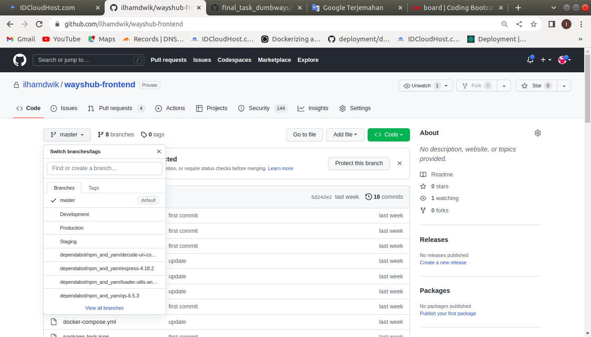
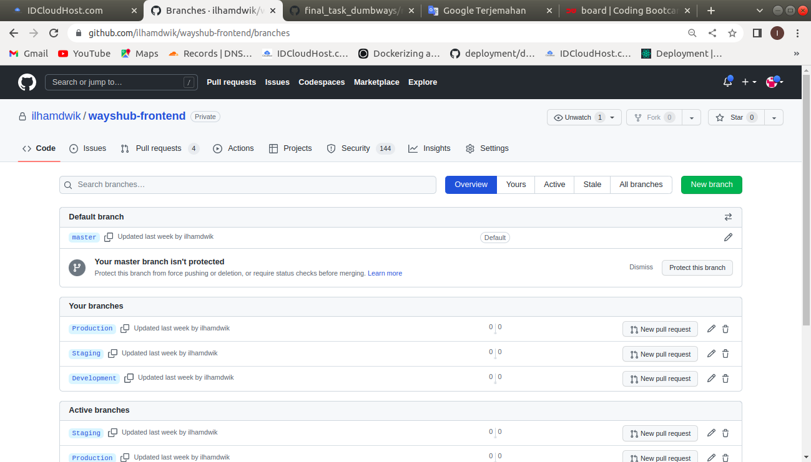
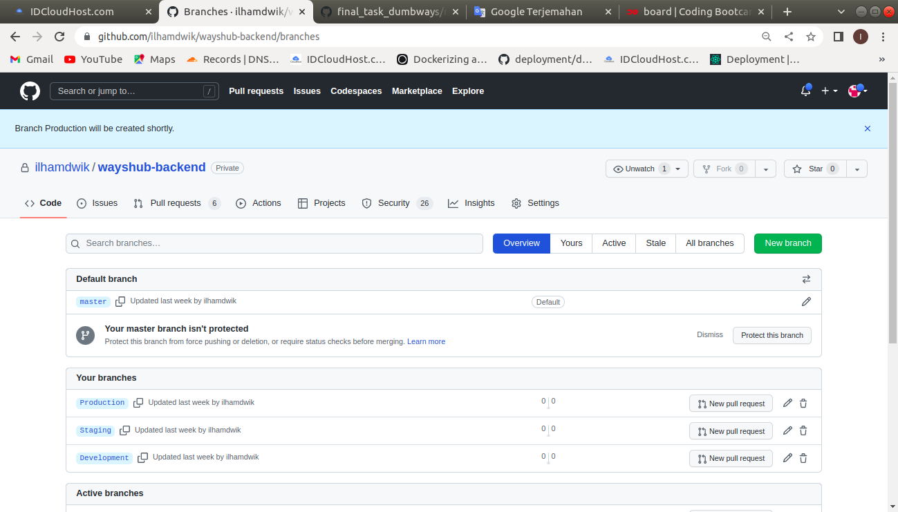
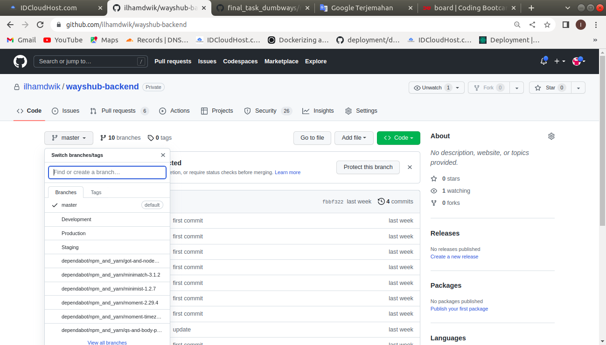
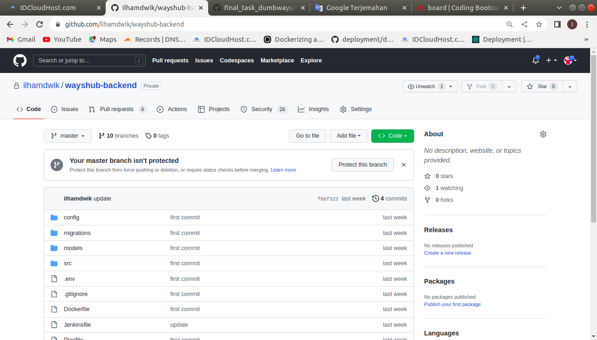

# Repository

## Before you start the task, please read this:
### - Please screenshot the command step-by-step
### - Describe the process in your final task repository

## Requirements
### - Create your own repository
   * #### - https://github.com/dumbwaysdev/wayshub-frontend
   

   * #### - https://github.com/dumbwaysdev/wayshub-backend
   

## Instructions

### - Create 3 branches

  * #### - Development

  

  

  * #### - Staging

  

  

  * #### - Production

  

  

  * #### wayshub-frontend
  

  

  * #### wayshub-backend
  

  

  

## - Set the repository to **Private**
## - Use the repository for CI/CD and Deployment