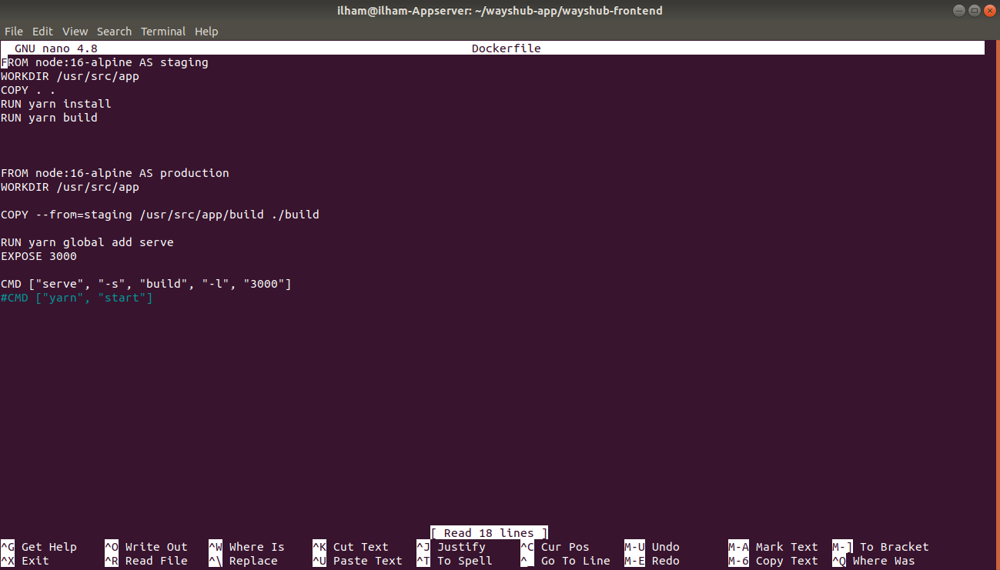
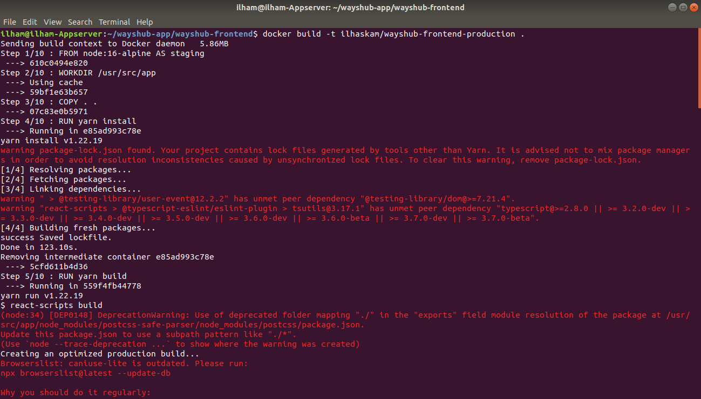

# Deployment

## Before you start the task, please read this:
### - Please screenshot the command step-by-step
### - Describe the process in your final task repository

## Requirements
### - Docker
### - Docker Hub Credentials
### - PostgreSQL (*Database*)


## Instructions


### - Build for 2 branches

#### - *Staging*

* #### - Pindah ke branch Staging. - Frontend
```
git checkout Staging
```


* #### - Buat Dockerfile. Di branch Staging saya men-deploy tanpa docker multi stage builds, untuk mengetahui perbedaan antara tanpa menggunakan multi stage dan dengan menggunakan multi stage.


* #### - Buat docker-sompose.yml.


* #### - Lalu build aplikasi wayshub-frontend.
```
docker build -t [nama_images] .
```


* #### - "docker images" untuk mengecek apakah images sudah terbuat. "docker compose up -d" untuk menjalankan apa yang sudah kita konfigurasi di dalam file docker-compose.yml. "docker ps -a" untuk mengecekapakah container sudah berjalan diport yang sudah kita tentukan di dalam file docker-compose.yml.
```
docker nama_images

docker compose up -d

docker ps -a
```


* #### - Pindah ke branch Staging. - Backend

* #### - Untuk step-stepnya kurang lebih sama seperti deploy frontend.


* #### - Aplikasi wayshub - Staging


#### - *Production*

* #### - Pindah ke branch Production. - Database


* #### - docker-compose.yml database branch Production menggunakan PostgreSQL.


* #### - Pindah ke branch Production. - Backend


* #### - Pindah ke branch Production. - Frontend







* #### - Aplikasi wayshub - Production


### - Dockerize image as small as possible

* #### Disini saya bisa mendapat size terkecil 130MB di Frontend dan 122MB di Backend.


### - Front-end + Back-end + Database Integration

* #### Disaat aplikasi bisa login dan register, maka secara otomatis integrasi frontend, backend, dan database sudah berjalan baik.


### - Use different enviroment for *Production*
### - For *Production*, do not use *npm run*

* #### Disini saya menggunakan serve, -s, build, -l untuk environtment untuk production.


### - Use **distroless** for *Production* (*Crucial Challenge*)