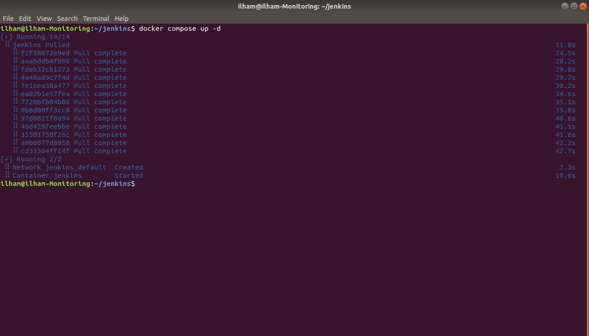
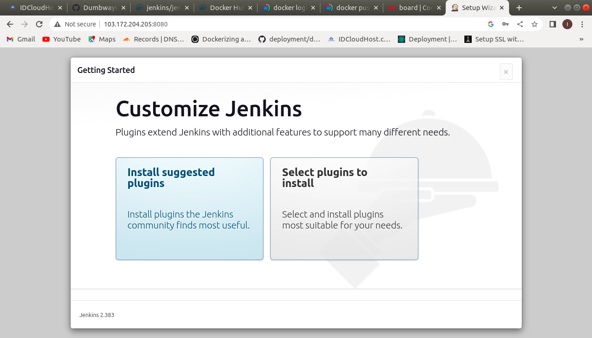
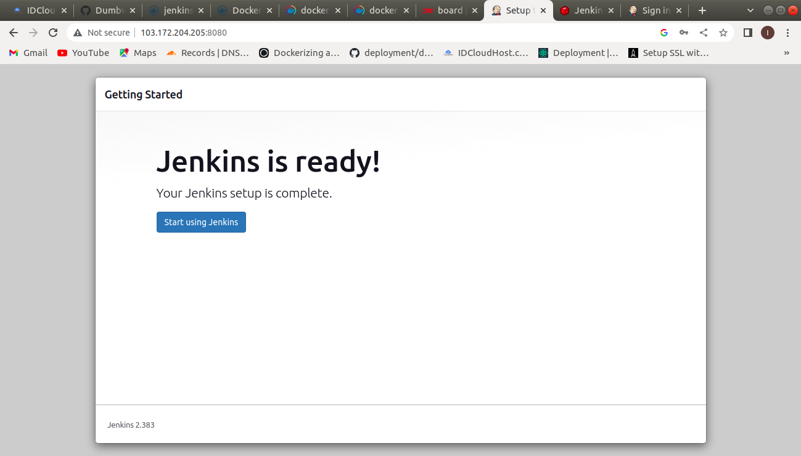

# CI/CD

## Before you start the task, please read this:
### - Please screenshot the command step-by-step
### - Describe the process in your final task repository

## Requirements
### - install at monitoring server
### - Jenkins / Gitlab CI
### - Pipeline script
  #### - Pull Repository
  #### - Build, test & run the application
  #### - Push to registry

## Instructions
### - Auto-trigger build for every push
### - Push notification for every build
### - Run the pipeline on a multi-branch configuration
### - Push the image into a private registry (*Challenge*)





* #### Setelah menginstall Jenkins di server. Kita jalankan dahulu docker logs nama_container.
```
docker logs jenkins
```


* #### Secara otomatis jenkins akan men-generate password untuk login sebagai admin.


* #### Copy paste pada step 6.


* #### Pilih select plugin to install.



* #### Disini kita bisa memasukkan username dan password baru.





* #### Masuk ke dashboard, manage jenkins, credentials, system, global credentials.


* #### Masukkan private key ke dalam jenkins.


* #### Agar akun jenkins dan github terhubung, maka masukkan juga public key ke dalam github.


* #### Buat job baru.


* #### Pilih multibranch pipeline, dikarenakan kita ingin membuat ci_cd dengan banyak branch.


* #### Pilih git.


* #### Dikarenakan repository yang saya pakai bersifat private maka bisa menggunakan SSH. Copy link SSH di github, lalu paste kedalam git repository di dalam jenkins.


* #### Pilih credentials ilhaskam.


* #### Untuk mengaktifkan Multibranch Scan Webhook Trigger, install terlebih dahulu plugin bernama Multibranch Scan Webhook Trigger.


* #### Untuk mengaktifkan trigger pada saat ada update di repository akun github kita. Maka pada github kita tambahkan di bagian Webhooks. Untuk payload URL yang dimasukkan di github repository bisa melihat pada step sebelumnya.


* #### Pada saat muncul centang dan berwarna hijau, maka trigger sudah berjalan dengan baik.


* #### Menambahkan notifikasi discord.
* #### Pilih pipeline sintax.


* #### Masuk ke dalam channel discord lalu pilih edit channel.


* #### Pilih Integrations.


* #### Pilih webhooks, lalu create webhook.


* #### Copy webhook URL.


* #### pada kolom Sample Step pilih discordSend. Lalu paste webhook URL tadi.


* #### Generate pipeline script.


* #### Copy paste script ke dalam pipeline yang sudah kita buat.


* #### Maka jika ada update script dari repository github makapembaruan di jenkins juga akan langsung dijalankan secara otomatis..


* #### Discord notifikasi sudah berhasil muncul.


* #### Disini sat push private registry saya menggunakan registry dari cloud.canister.io


* #### Login ke dalam registry cloud.canister.io


* #### Command ini membuat tag dari images ilhaskam/wayshub-frontend-production-jenkins dan mengubahnya menjadi cloud.canister.io:5000/ilhaskam/wayshub-frontend.


* #### Maka akan terbuat images baru bernama cloud.canister.io:5000/ilhaskam/wayshub-frontend.


