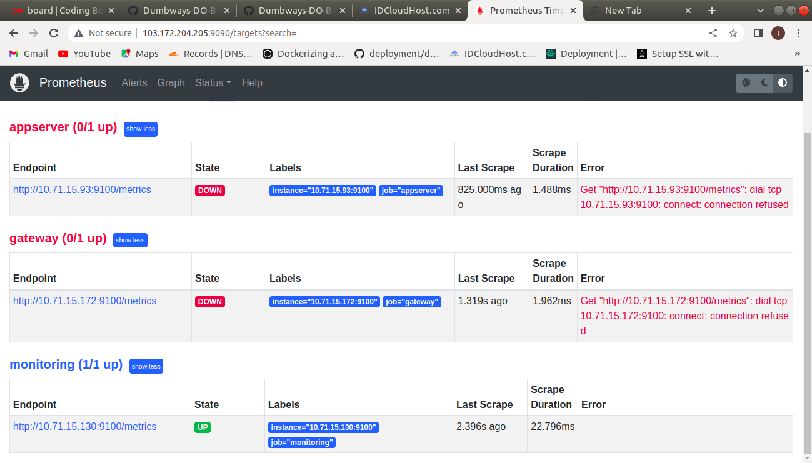

# Monitoring

## Before you start the task, please read this:
### - Please screenshot the command step-by-step
### - Describe the process in your final task repository

## Requirements
### - Prometheus
### - Grafana Dashboard
### - Alertmanager / Grafana Alert

## Instructions
### - Monitor the *Appserver* and *Gateway*
### - Create 2 Dashboards
  #### - Use template for the first dashboard
  #### - Second dashboard for alerting
### - Use alerting to notify
  #### - CPU usage over 75%
  #### - RAM usage over 1.25 GiB

* #### Masukkan volumes untuk config prometheus.

* #### Buat directory config, lalu di dalam direktory config buat file prometheus.yml. File ini bermaksud bahwa prometheus membaca data metrics dari node exporter di dalam ip yang dimaksudkan. Seperti memberi tahu bahwa target yang ingin di monitoring.

* #### Node Exporter.

* #### Status target yang telah dimasukkan di file prometheus.yml, jika state "DOWN" maka server dari target belum tersambung atau server dari target masih mati atau kita salah dalam meng-configurasi target yang kita masukkan di dalam file prometheus.yml. 

* #### Jika state "UP" maka target sudah terhubung dan kita sudah bisa memonitoring target.

* #### Membuat alerting. klik new alert rule.

* #### Membuat template di grafana.

