# Web Server

## Before you start the task, please read this:
### - Please screenshot the command step-by-step
### - Describe the process in your final task repository

## Requirements
### - NGINX / Apache
### - SSL Certbot

## Instructions
### - Use these domains :
  #### - <name>.studentdumbways.my.id [Deployment]
  #### - api.<name>.studentdumbways.my.id [Deployment]
  #### - node.<name>.studentdumbways.my.id [Node Exporter]
  #### - dash.<name>.studentdumbways.my.id [Grafana Dashboard]
  #### - prom.<name>.studentdumbways.my.id [Prometheus]
  #### - jenkins.<name>.studentdumbways.my.id [Jenkins]

### - SSL Certificates using wildcard
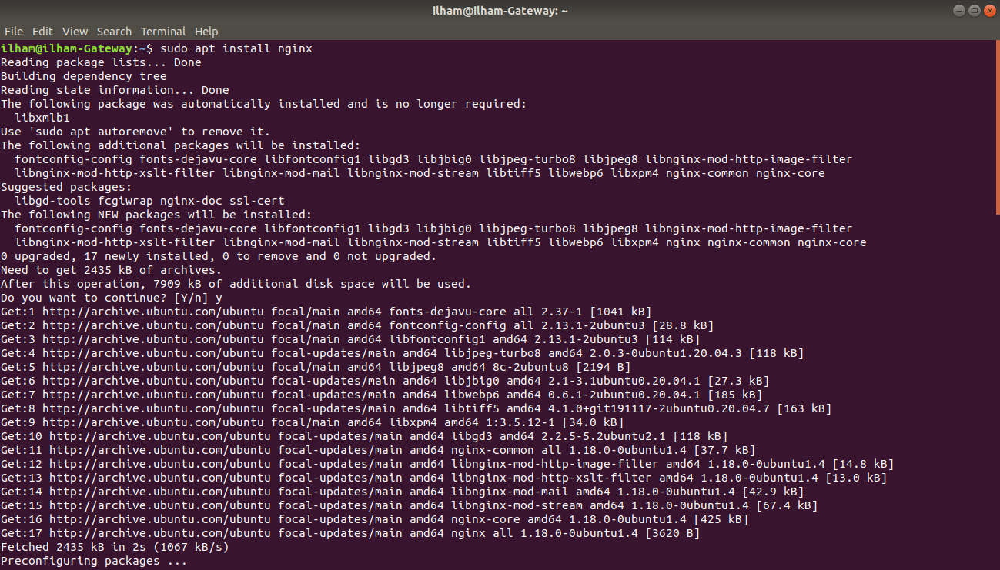

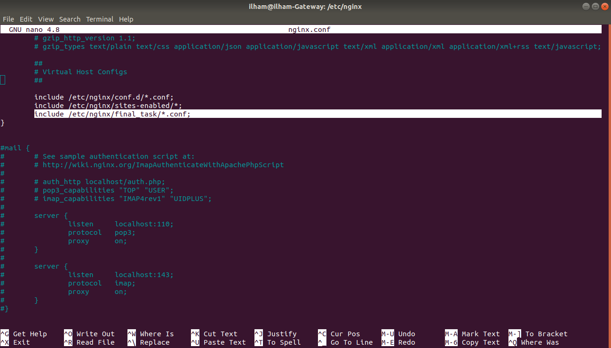

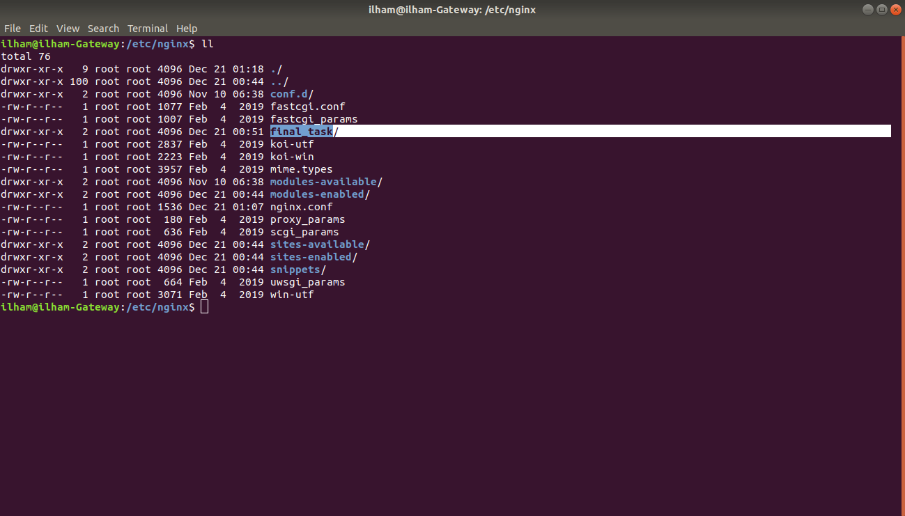

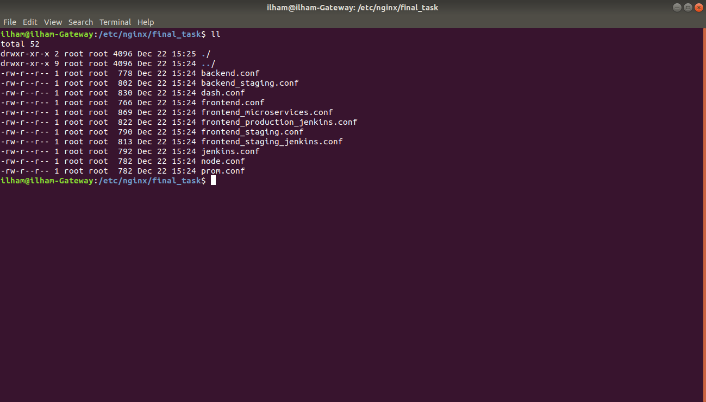

### - Deploy the certificate using ansible (*Challenge*)

* #### Install nginx.

* #### Step ini agar nginx bisa mengetahui bahwa kita membuat configurasi di dalam file final_task dengan membaca semua file dengan format .conf.

* #### Buat folder final_task.

* #### Disini saya sudah membuat configurasi SSL certificate certbot menggunakan wildcard, jadi SSL certbot ini akan secara otomatis menambahkan configurasi tambahan di dalam file configurasi nginx kita.
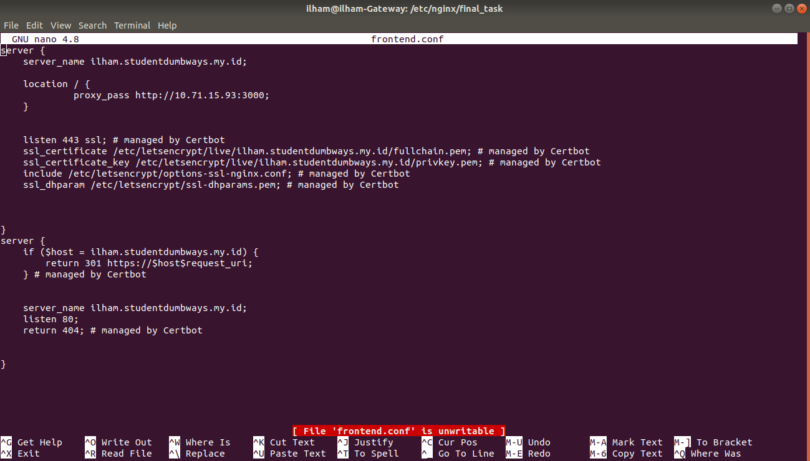

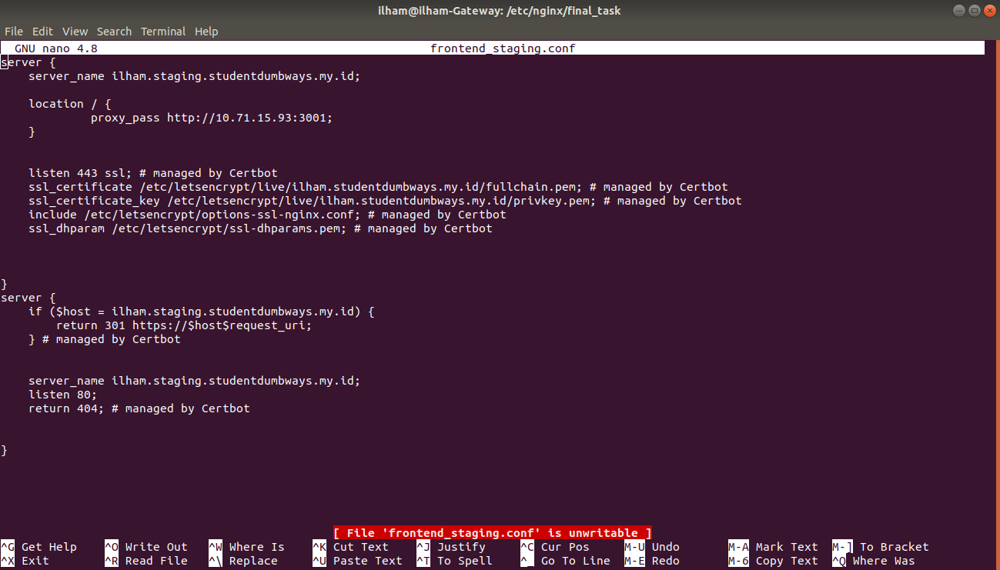

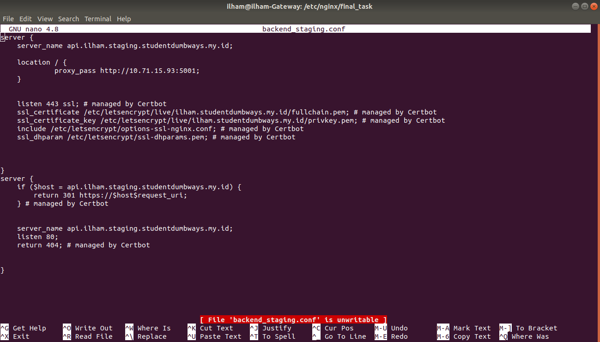

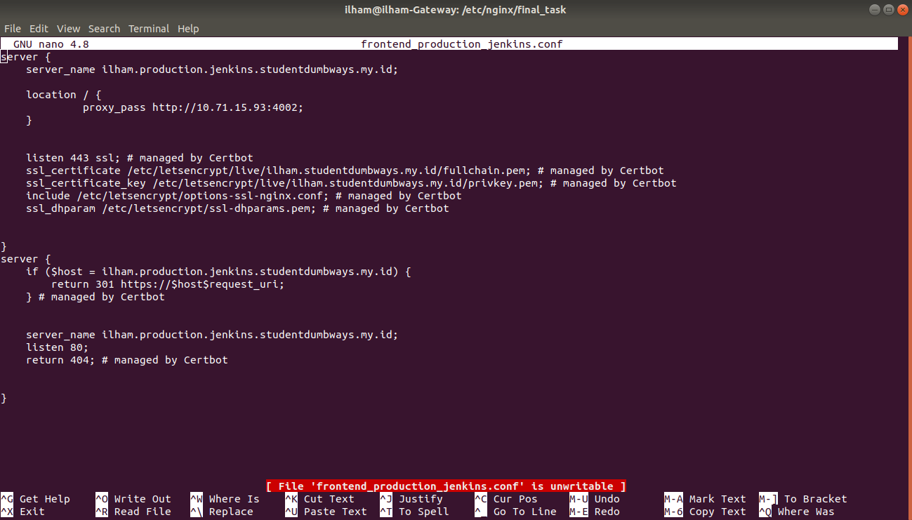

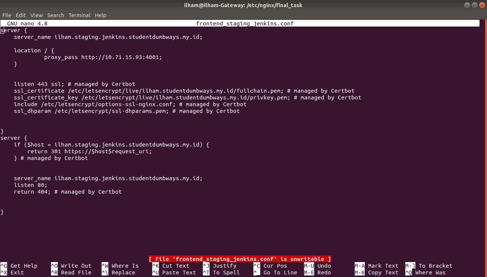

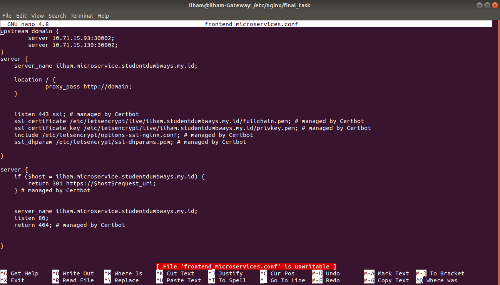

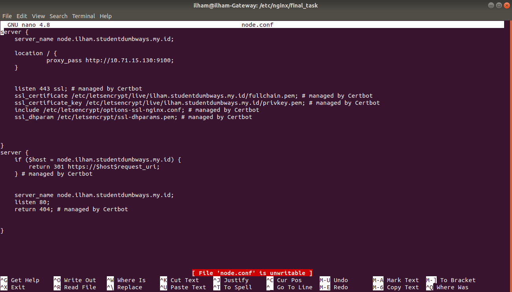

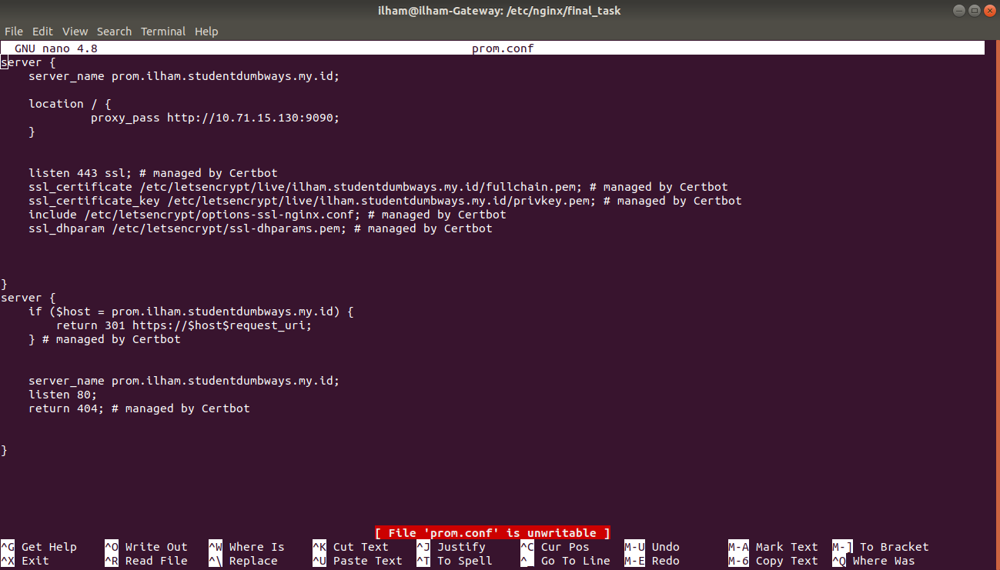

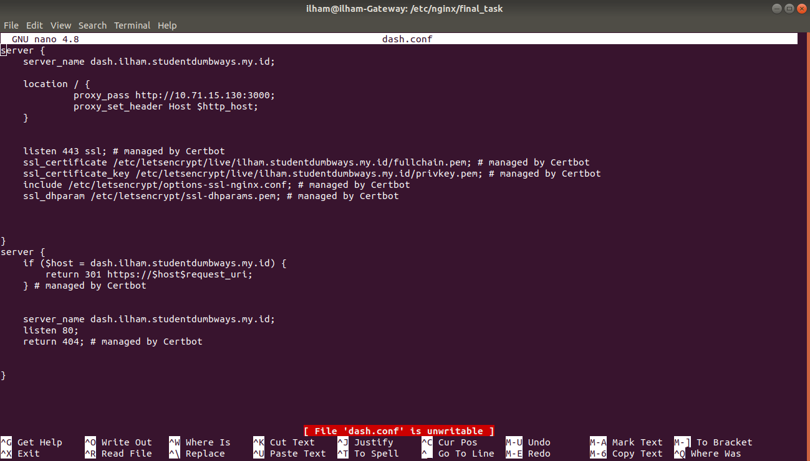

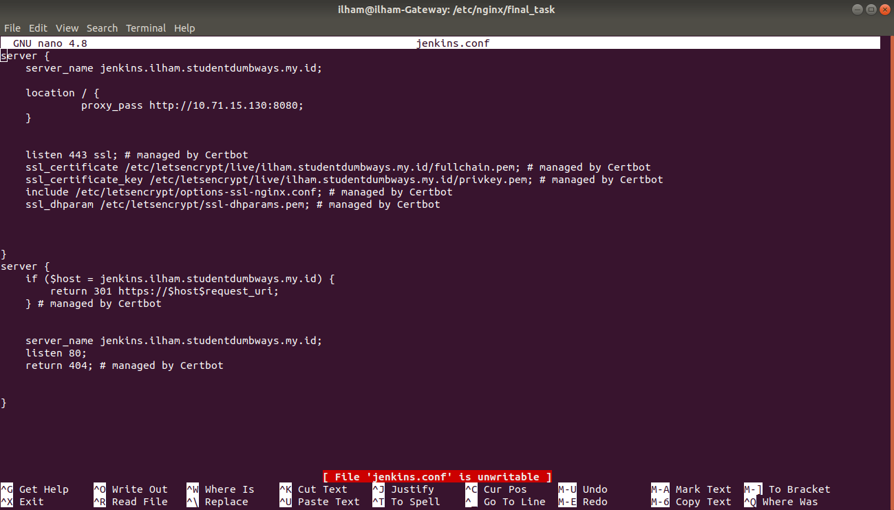