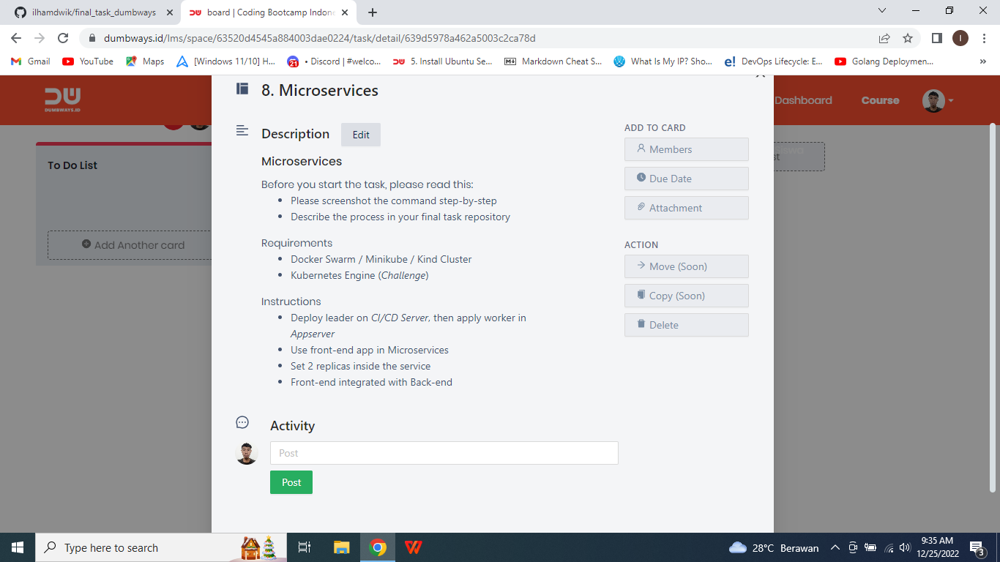

# Microservices

## Before you start the task, please read this:
### - Please screenshot the command step-by-step
### - Describe the process in your final task repository

## Requirements
### - Docker Swarm / Minikube / Kind Cluster
### - Kubernetes Engine (*Challenge*)

## Instructions
### - Deploy leader on *CI/CD Server*, then apply worker in *Appserver*
### - Use front-end app in Microservices
### - Set 2 replicas inside the service
### - Front-end integrated with Back-end

* #### - Menginisialisasi docker swarm init sebagai leader.
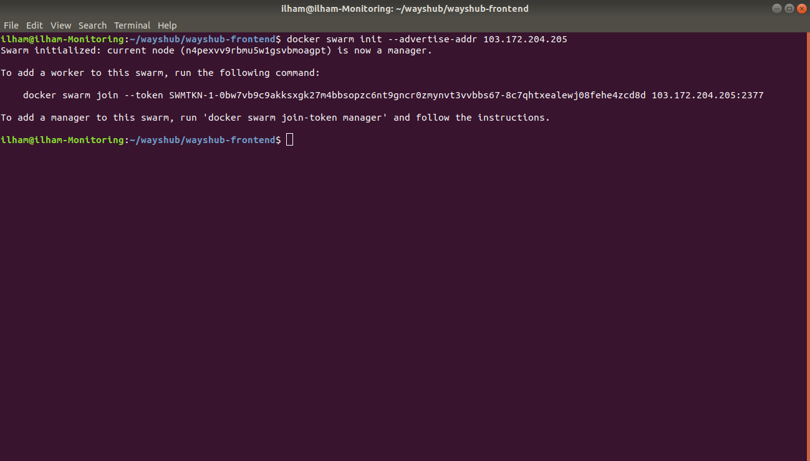

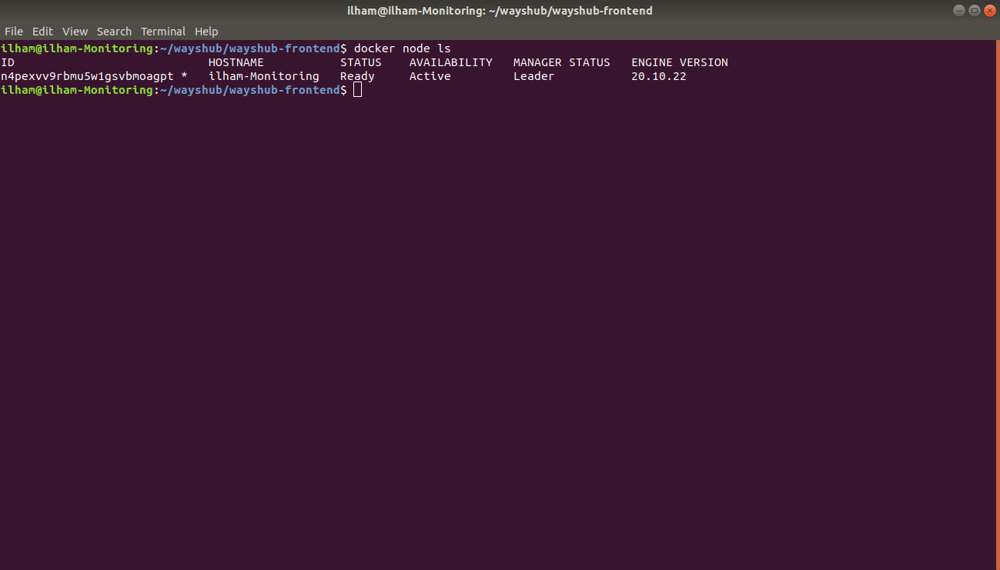

* #### - Menginisialisasi docker swarm join untuk menambah worker.
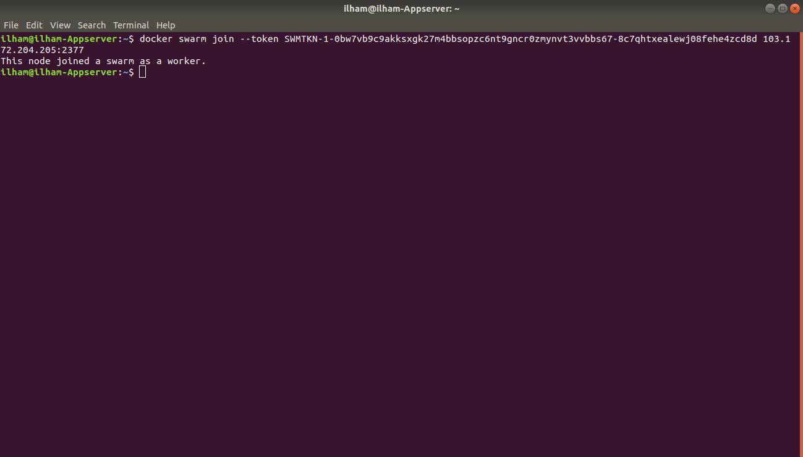

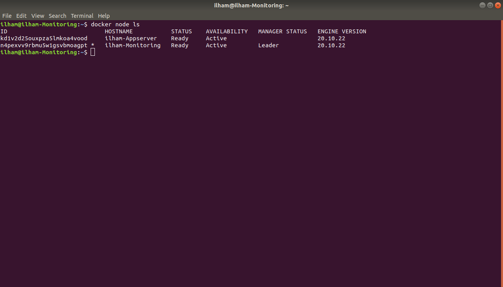

* #### - Pull images dari docker hub.
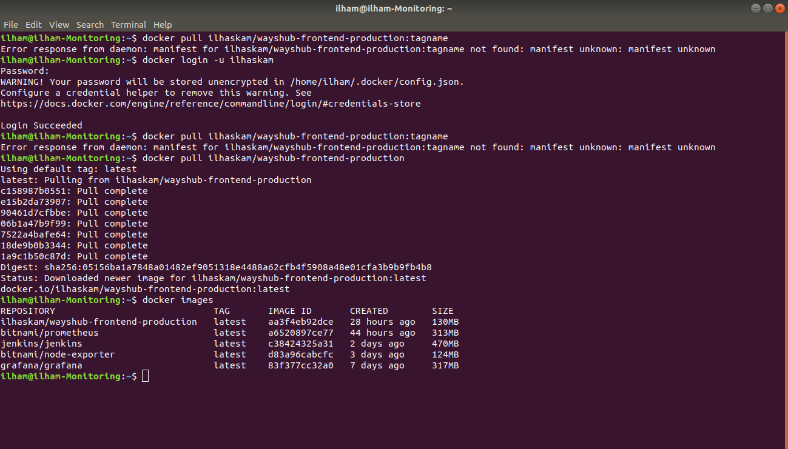

* #### - Membuat dan menjalankan service. Docker swarm secara otomatis akan memberikan port kepada service yang dijalankan.
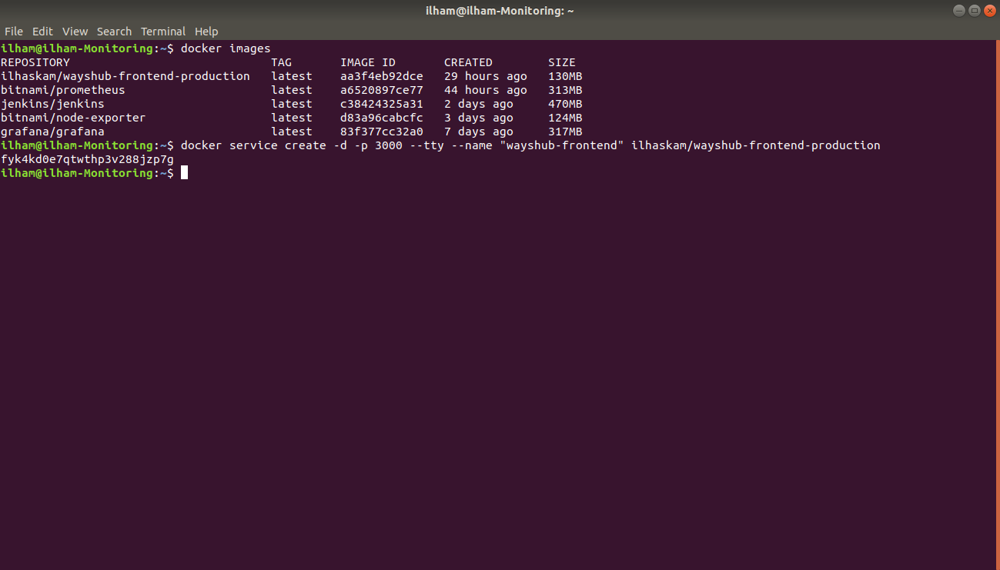

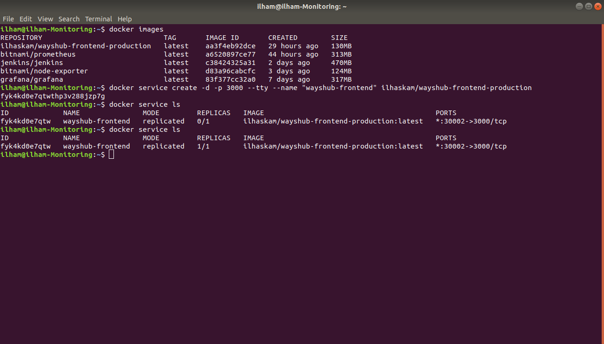

* #### - Scale untuk membuat replica aplikasi. Jadi kita mempunyai satu aplikasi dan ingin memperbanyak aplikasi kita agar jika mengalami down di salah satu server, maka client masih bisa mengakses aplikasi kita di server yang lain yang masih berjalan dengan normal.
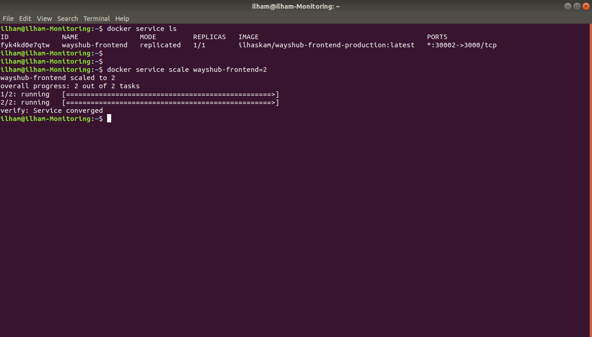

* #### - Bisa dilihat disini bahwa setelah melakukan scale, aplikasi kita bisa berjalan di dua server berbeda monitoring dan appserver.
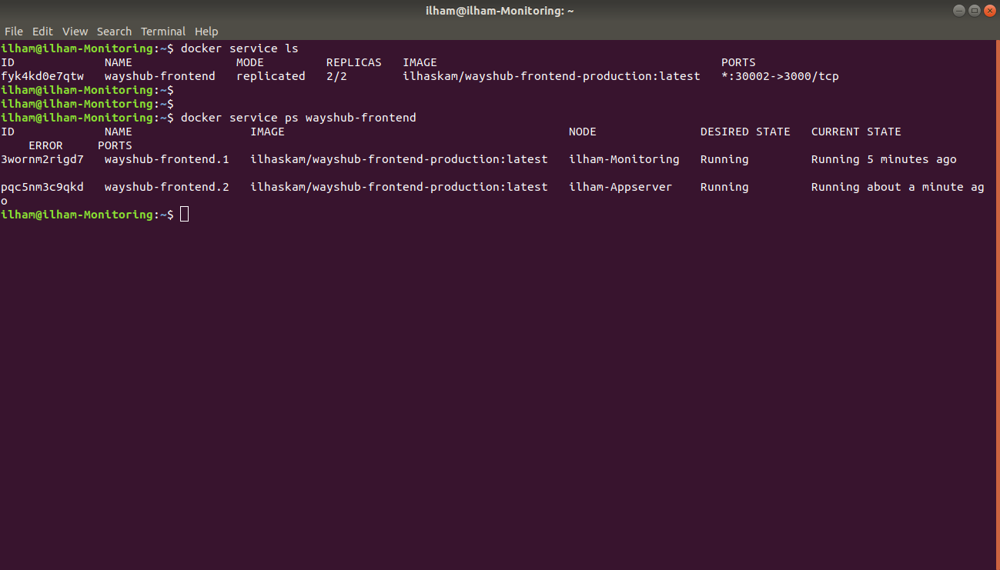

* #### - Bisa dilihat bahwa saya menggunakan ip berbeda saat mengakses aplikasi wayshub.
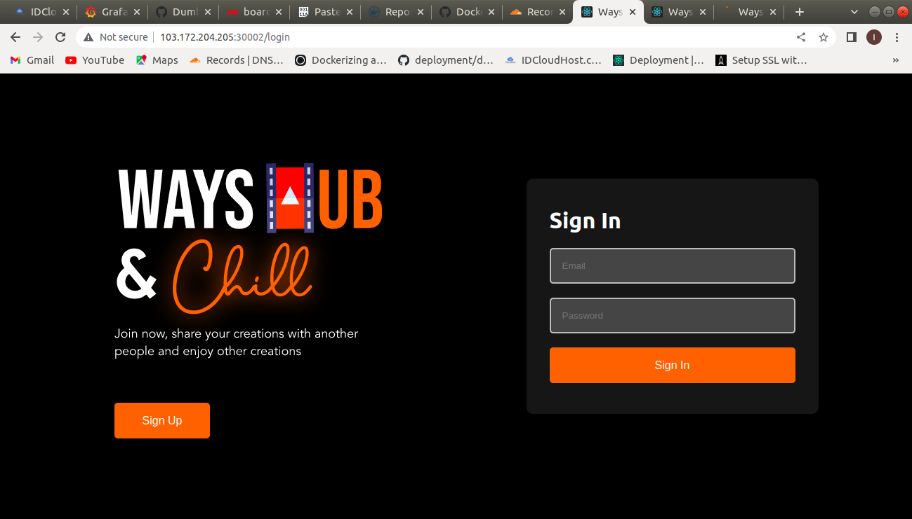

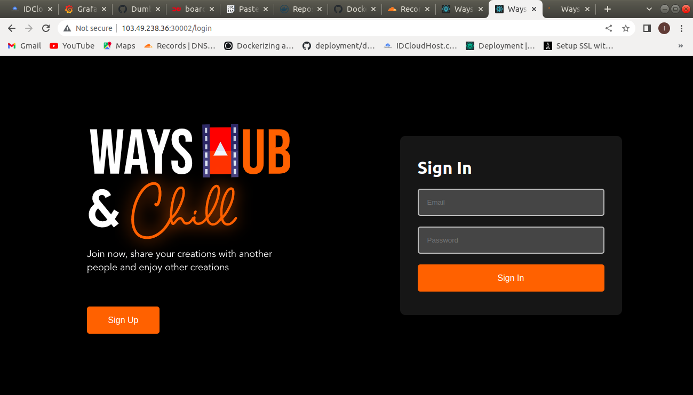

* #### - Saya sudah membuat load balance yang berguna bila mengalami down di salah satu server, maka client masih bisa mengakses aplikasi kita di server yang lain yang masih berjalan dengan normal.
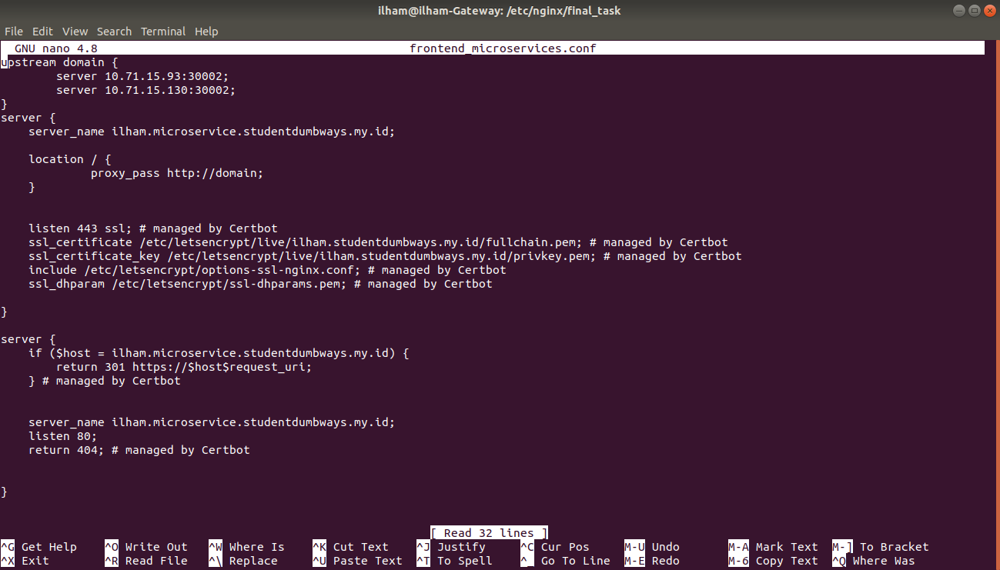

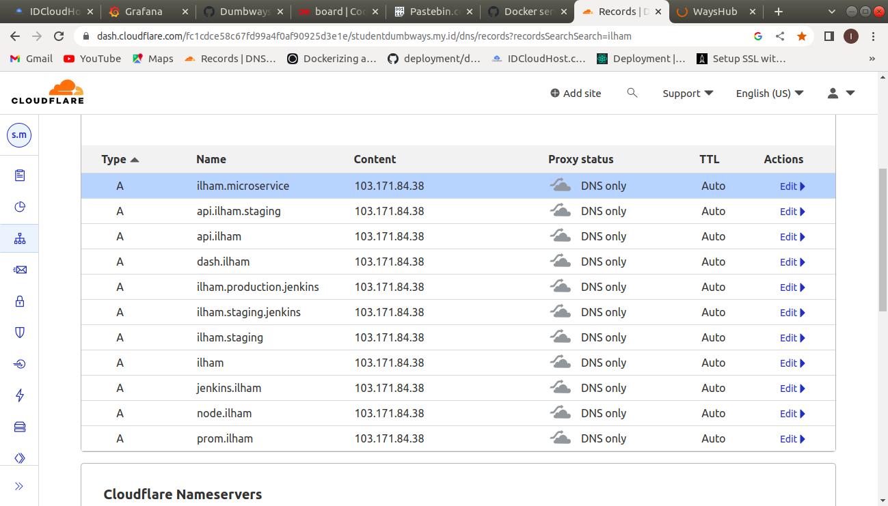

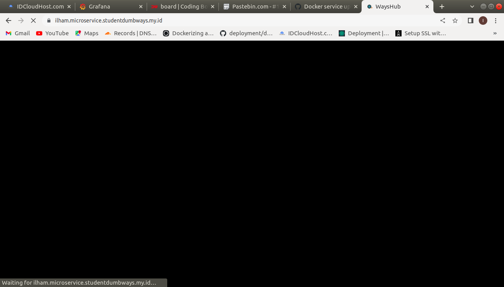